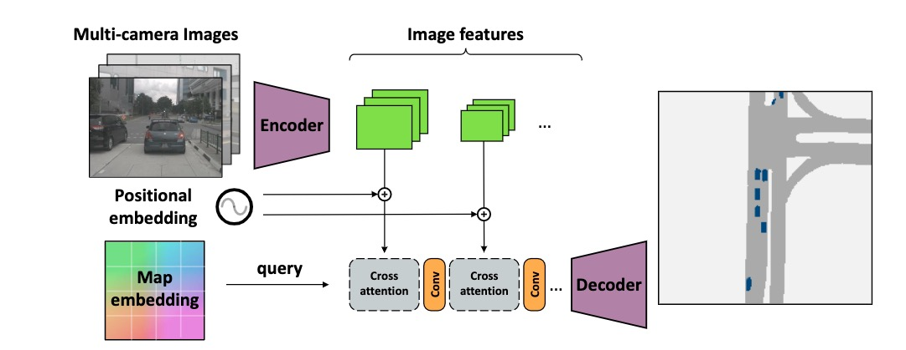
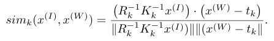
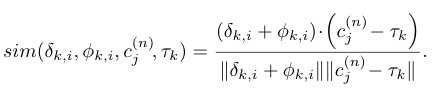
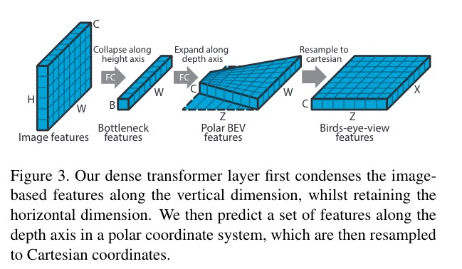
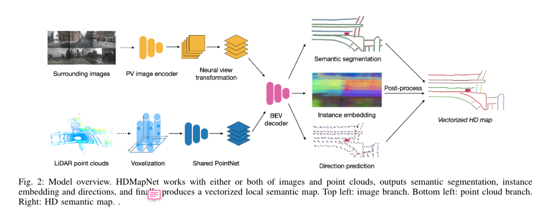

学习&参考资料：

+ [Transformer BEV Perception](https://zhuanlan.zhihu.com/p/497434621)

+ [Monocular BEV Perception with Transformers in Autonomous Driving](https://towardsdatascience.com/monocular-bev-perception-with-transformers-in-autonomous-driving-c41e4a893944)  by [Patrick Langechuan Liu](https://medium.com/@patrickllgc?source=post_page-----c41e4a893944--------------------------------)

+ https://github.com/patrick-llgc/Learning-Deep-Learning by Patrick Langechuan Liu
+ https://github.com/chaytonmin/Awesome-BEV-Perception-Multi-Cameras

------

#### 1.Cross-view Transformers for real-time Map-view Semantic Segmentation

[CVPR2022 oral, 2022 May]

contribution：

+ 用隐式的PE来建模不同相机之间的位置关系
+ cross attention：用（camera aware embedding+图像特征）做keys，map-view embedding做queries
+ 性能在*nuScenes*上SOTA (37.5/36.5)，4xfaster (35fps)

总的结构：

CVT的backbone是EfficientNet，在encoder最深层的特征处做cross attention，decoder是3层上采样+cnn

核心是隐式表示cross view，从单应性投影矩阵变换开始推导：

其中$ \approx$ 是表示scale，相机模型里面这个scale是跟深度相关的一个量，其他向量都用的是齐次坐标，单应性变换建立起了图像坐标系和**世界坐标系**之间的关系，表示成余弦相似度（attention的形式，其实一直不知道这一步是怎么想到的），有：

将scale表示成相似度，空间上重合，应该是相似度最高，写成向量乘法，就成了transformer中的attention形式，接下来就是如何将位置信息编码进去，相机内外参都是已知的

从左到右分别是：unprojected image coordinate表示，图像特征，map-view embeddings，和相机位置embedding（这个相机位置指的应该是相机的相对几何距离）

总结：

+ 可能是目前看到的方法里面最SOTA的，在nuScenes上达到了37左右

+ cross attention的思想在很多工作中都有应用，但是这篇文章的attention形式和位置编码不容易想到

+ backbone没有用transformer，还是cnn的结构

+ 从消融实验上看，camera-aware embedding对效果提升最大

+ 对比了：PON，OFT，VPN，STA，Lift-Splat-Shoo， FIERY等的性能

+ cross attention是核心部分，因此作者特意做了消融实验：

  > The  most  important  component  of  our  system  is  thecamera-aware positional embedding.  It bestows the atten-tion  mechanism  with  the  ability  to  reason  about  the  geo-metric layout of the scene.  Without it, attention has to relyon the image feature to reveal its own location.  It is possi-ble for the network to learn this localization due to the sizeof the receptive field and zero padding around the boundaryof the image. 
  >
  > ...
  >
  > On the other hand, apurely geometric camera-aware positional embedding aloneis also insufficient. 

------

#### Predicting Semantic Map Representations from Imagesusing Pyramid Occupancy Networks

[CVPR2020, May,2020] PON

Contribution:

+ propose  a  novel  dense  **transformer  layer**  whichmaps  image-based  feature  maps  into  the  birds-eye-view space.
+ We design a deep convolutional neural network archi-tecture, which includes a **pyramid** of transformers op-erating  at  multiple  image  scales
+ 在2个large-scale  au-tonomous driving datasets 上SOTA

核心部分应该是金字塔结构+ transformer layer

这里面引入一个概念：占据栅格地图（Occupancy Grid Map），详见：[自动驾驶Mapping-知乎](https://zhuanlan.zhihu.com/p/107048898), 贝叶斯占据栅格模型：当前占据 = 当前inverse观测+ 上一时刻占据+初始时刻占据

这里，勉强都能理解，但是精度会高吗？从polar坐标系，到卡迪尔坐标系，乘了一个斜边比直角边，一个比较trick的地方：

> features corresponding to grid cells far from the camera will beblurred whilst those close to the camera will be undersam-pled and aliasing can occur.  We therefore propose to applymultiple transformers, acting on a pyramid of feature mapswith downsampling factors.

这个操作就相当于图像的缩放，因为图像缩放是会导致相机内参矩阵变化的（缩小多少倍，内参矩阵前两行就除以多大的系数，如果是这样的话是不是可以考虑swin transformer？）

还有一个trick是要crop原分辨率的图像：

> corresponding to a fixed vertical range betweenyminandymaxin the world space. This means that the heights of thecropped feature maps stay roughly constant across scales

总结：

+ 总觉得把图像做成金字塔缩放有很多trick在里面，这其中还包括crop 图像高度H

+ 没有建模相机外参的关系，用一个奇怪的transform模块来做这个变换

+ 对比了VED，VPN等模型，此外，对照组：只用homography，单目估计深度+投影，GT点云+投影

  > We present a sim-ple baseline inspired by other works [8, 23] of mapping animage-based semantic segmentation to the ground plane viaa homography.  The image-level segmentation is computedusing a state-of-the-art DeepLabv3 [6] network, pretrainedon Cityscapes [7], which shares many classes in commonwith both NuScenes and Argoverse. The ground planes areobtained  either  by  fitting  a  plane  to  LiDAR  points  in  thecase of NuScenes, or using the precomputed ground heightsprovided by Argoverse. 

+ backbone是cnn，top-down network是8层resnet
+ 消融实验证明，dense  transformer 最有效
+ Loss 上面也有trick，有一个uncertain loss，最大化行人的交叉熵，这部分没有消融实验

------

#### Lift, Splat, Shoot: Encoding Images fromArbitrary Camera Rigs by ImplicitlyUnprojecting to 3D

[ECCV2020, August 2020] 效果上看优于PON （nuScenes：Vehicles，Drivable）

Contribution:

+ 跟其他的方法相比，lift and splat可以处理任意多的输入图像（这里终于明白为什么PON没有建模外参的关系），并且：By training on the entire camera rig, we provide evidence that our model is able to learn not only how to represent images but how to fuse  predictions  from  all  cameras  into  a  single  cohesive  representation of the scene while being robust to calibration error.
+ nuScenes上效果优于PON，在当时SOTA

MVS方法里面的plane sweeping，需要假设深度，这里面也差不多用到了这个想法，因为聚合各个视角的信息一直都是个难点，当然LSS没有对相机关系进行建模，这上面所说的做外积，也只是在D和C channel上面做，本质上是用alpha的概率，来对特征context C进行加权

> In summary, ideally, we would like to generate a functiongc: (x,y,z)∈R3→c∈RCfor each image that can be queried at any spatial location and returna context vector.

有了深度之后[H,W,D]其实可以通过homography变换成世界坐标系的[x,y,z]

有了点云之后，后面的步骤就和pillar pooling一样了

总结：

+ 感觉最重要的一个点在于multi-view，如何聚合多视角的信息，文中是把点按照概率map到3D的空间，然后再做信息的聚合，但是这里面我比较疑惑的一个点是，这些视角里面交叉的部分应该不多？multi-view对性能提升有多大？作者在这里做了一组实验，说baseline模型是单目的，证明多目的性能是有提升的
+ 网络结构：提取特征部分用的是efficientNet，Bev部分用的是Resnet，大部分和OFT是一样的

#### ViT-BEVSeg: A Hierarchical Transformer Network for Monocular Birds-Eye-View Segmentation

[WCCI2022-IJCNN, May 2022]

Contribution:

+ 用vit作为backbone来提取特征
+ We  combine  a  series  of  vision  transformer  blocks  in  ahierarchical configuration to compute and fuse represen-tations across multiple spatial scales.
+ end-to-end Bev Semantic
+ nuScenes上SOTA，但其实没有和CVT以及LSS比，性能高于PON和OFT，2D-Lift等，但似乎没有高于LSS？

总结：

+ 总的结构像是在follow PON，因此让我觉得比PON好是应该的，因为backbone换成了更powerful的transformer
+ 看PON的时候就觉得能不能把backbone换成swin transformer，但是Vit-BEVSeg似乎没有用到swin-transformer的框架，
+ decoder也用的transformer？感觉要看一下PON的代码才能理解

------

#### HDMapNet: An Online HD Map Construction and Evaluation Framework

[ICRA2022, Jul 2021]

Contribution：

+ online framework for HD semantic
+ novel feature projection module fromperspective  view  to  bird’s-eye  view，显式建模相机外参，但是隐式建模3D环境
+ 提出了新的metric和evaluation protocols

不同于MVS的plane sweeping，本文用全连接将图片从 perspective  view 变换到相机坐标系，然后通过单应性变换将相机坐标系变换到Bev坐标系，在Bev坐标系下求每个视角的平均（单看这一步，很粗糙，他的深度是从雷达来的？从目标视角做平均值效果应该不如在3D上做聚合的效果好）

另一个分支使用PointPillar来提取点云特征，PointNet

Bev Decoder输出：pixel level的分割，instance-level的embedding，以及lane direction，decoder用的是fcn的结构，总的来说有三个分支的任务

总结：

+ 看完觉得有个问题，就是  HDMapNet(Surr)的深度是怎么来的？图片坐标系到相机坐标系真的一个MLP就能解决吗？
+ 三个分支的任务，着重看了一下语义分割，HDMapNet(Surr)直觉上会比LSS粗糙，但是结果居然优于LSS
+ 实验非常充分，包括三个分支的任务，说明确实是好，但是创新性感觉一般

------

#### Scene Representation in Bird’s-Eye View from Surrounding Cameras with Transformers

[CVPR2022] [代码未开源]

Contribution:

+ End-to-end multi-view
+ Transformer-based encoder-decoder
+ 性能SOTA

计算cross attention的地方跟DETR很像：PV作为k和v，Bev作为q，最后得到Bev特征

PE：没有建模相机之间的关系！！

> The fixed positional encodings in the 3D case describedabove is a simple implementation for multiple camera fea-ture maps. It is a suboptimal method for representing posi-tional information of camera features, as it cannot expressthe positional relations between covered regions of nearbycameras.  However, it works well on Nuscenes [2] dataset.An  important  reason  is  that  the  monocular  images  fromneighboring cameras in the Nuscenes dataset contain fewoverlapping areas.

重新思考一下cross view 或者multi-view的意义了，这个方法到底是transformer好还是multi-view好？

总结：

+ 真正意义上的用transformer作为backbone，但是没有将相机的位置关系建模进去

+ multi-view在nusence上的意义大不大？LSS有探讨过多目的意义

+ transformer encoder作用似乎不大：

  > our  model  still  gains  good  performanceeven without the encoder module.  It indicates that the ex-tracted image-based features are powerful enough to cap-ture  the  appearance  and  spatial  information

+ 比CVT report的结果要好得多，这就是cross attention的威力吗

+ 作者report出来的结果，LSS在nuScenes（Vehicles）上的IoU高达53.8，但是论文里写的是32.7

------

#### SelfD: Self-Learning Large-Scale Driving Policies From the Web

[CVPR2022]

#### BEVSegFormer: Bird's Eye View Semantic Segmentation From Arbitrary Camera Rigs

[arxiv 2022, Mar.] [代码未开源]

Contribution:

+ 

#### Cross-view Semantic Segmentation for Sensing Surroundings

[RA-L 2020, June 2019]

Contribution:

+  首次提出cross-view语义分割（多目）

  > We  introducea   novel   task   named cross-view   semantic   segmentationtofacilitate robots to flexibly sense the surrounding environment.

+ We  propose  a  framework  withView  Parsing  Networkwhich  effectively  learns  and  aggregates  features  across  first-view observations with multiple angles and modalities.

+ DA将网络迁移到真实数据和场景中

 View Relation Module (VRM)建模相机之间的关系，MLP来学习视角之间的关系

View Fusion Module (VFM) 只是简单的把RGB和depth转换出来的视角都加在一起，总的来说比较粗糙

Nuscenes 上：

| method     | Input   | Views | IoU  | Runtime       | Res.                    | class |
| ---------- | ------- | ----- | ---- | ------------- | ----------------------- | ----- |
| PON        | 800x600 | 1     |      |               | 50x100，200×200，0.5m   | small |
| LSS        | 128×352 | 6     |      | 35 hz/ 28.6ms | 100x100，200×200，0.25m |       |
| CVT        | 224x448 |       |      | 35fps/ 28.6ms | both                    |       |
| Vit-BevSeg | 384x384 | 1     |      | -             | 40x40，-，-             |       |
| CBTR       | 640x320 |       |      | 35ms          | 60x30，240x120，0.25m   |       |

bev seg：

1.  Cross-view Semantic Segmentation for Sensing Surroundings
2. Lift, Splat, Shoot: Encoding Images fromArbitrary Camera Rigs by ImplicitlyUnprojecting to 3D
3. Predicting Semantic Map Representations from Imagesusing Pyramid Occupancy Networks
4. Cross-view Transformers for real-time Map-view Semantic Segmentation 
5. Scene Representation in Birds-Eye-View from Surrounding Cameras with Transformers 

multi-view streo：

1. [MVSNet: Depth Inference for Unstructured Multi-view Stereo](https://arxiv.org/abs/1804.02505)
2. RMVSNet:Recurrent MVSNet for High-resolution Multi-view Stereo Depth Inference
3. Cascade Cost Volume for High-Resolution Multi-View Stereo and Stereo Matching
4. Cost Volume Pyramid Based Depth Inference for Multi-View Stereo
5. Fast-MVSNet: Sparse-to-Dense Multi-View Stereo With Learned Propagation
6. RC-MVSNet: Unsupervised Multi-View Stereo with Neural Rendering
7. MVSTER: Epipolar Transformer for Efficient Multi-View Stereo
