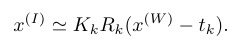
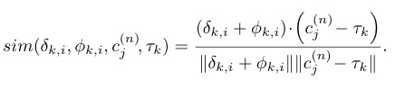

学习&参考资料：

+ [Transformer BEV Perception](https://zhuanlan.zhihu.com/p/497434621)

+ [Monocular BEV Perception with Transformers in Autonomous Driving](https://towardsdatascience.com/monocular-bev-perception-with-transformers-in-autonomous-driving-c41e4a893944)  by [Patrick Langechuan Liu](https://medium.com/@patrickllgc?source=post_page-----c41e4a893944--------------------------------)

+ https://github.com/patrick-llgc/Learning-Deep-Learning by Patrick Langechuan Liu
+ https://github.com/chaytonmin/Awesome-BEV-Perception-Multi-Cameras

------

#### Cross-view Transformers for real-time Map-view Semantic Segmentation

[CVPR2022 oral, 2022 May]

contribution：

+ 用隐式的PE来建模不同相机之间的位置关系
+ cross attention：用（camera aware embedding+图像特征）做keys，map-view embedding做queries
+ 性能在*nuScenes*上SOTA (37.5/36.5)，4xfaster (35fps)

总的结构：

CVT的backbone是EfficientNet，在encoder最深层的特征处做cross attention，decoder是3层上采样+cnn

核心是隐式表示cross view，从单应性投影矩阵变换开始推导：

其中$ \approx$ 是表示scale，相机模型里面这个scale是跟深度相关的一个量，其他向量都用的是齐次坐标，单应性变换建立起了图像坐标系和**世界坐标系**之间的关系，表示成余弦相似度（attention的形式，其实一直不知道这一步是怎么想到的），有：

将scale表示成相似度，空间上重合，应该是相似度最高，写成向量乘法，就成了transformer中的attention形式，接下来就是如何将位置信息编码进去，相机内外参都是已知的

从左到右分别是：unprojected image coordinate表示，图像特征，map-view embeddings，和相机位置embedding（这个相机位置指的应该是相机的相对几何距离）

总结：

+ 可能是目前看到的方法里面最SOTA的，在nuScenes上达到了37左右

+ cross attention的思想在很多工作中都有应用，但是这篇文章的attention形式和位置编码不容易想到

+ backbone没有用transformer，还是cnn的结构

+ 从消融实验上看，camera-aware embedding对效果提升最大

+ 对比了：PON，OFT，VPN，STA，Lift-Splat-Shoo， FIERY等的性能

+ cross attention是核心部分，因此作者特意做了消融实验：

  > The  most  important  component  of  our  system  is  thecamera-aware positional embedding.  It bestows the atten-tion  mechanism  with  the  ability  to  reason  about  the  geo-metric layout of the scene.  Without it, attention has to relyon the image feature to reveal its own location.  It is possi-ble for the network to learn this localization due to the sizeof the receptive field and zero padding around the boundaryof the image. 
  >
  > ...
  >
  > On the other hand, apurely geometric camera-aware positional embedding aloneis also insufficient. 

------

#### Predicting Semantic Map Representations from Imagesusing Pyramid Occupancy Networks

[CVPR2020, May,2020] PON

Contribution:

+ propose  a  novel  dense  **transformer  layer**  whichmaps  image-based  feature  maps  into  the  birds-eye-view space.
+ We design a deep convolutional neural network archi-tecture, which includes a **pyramid** of transformers op-erating  at  multiple  image  scales
+ 在2个large-scale  au-tonomous driving datasets 上SOTA

核心部分应该是金字塔结构+ transformer layer

这里面引入一个概念：占据栅格地图（Occupancy Grid Map），详见：[自动驾驶Mapping-知乎](https://zhuanlan.zhihu.com/p/107048898)

#### ViT-BEVSeg: A Hierarchical Transformer Network for Monocular Birds-Eye-View Segmentation

[WCCI2022-IJCNN, May 2022]

Contribution:

